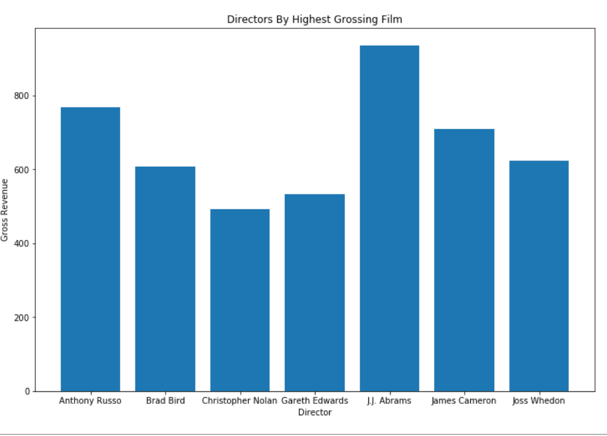
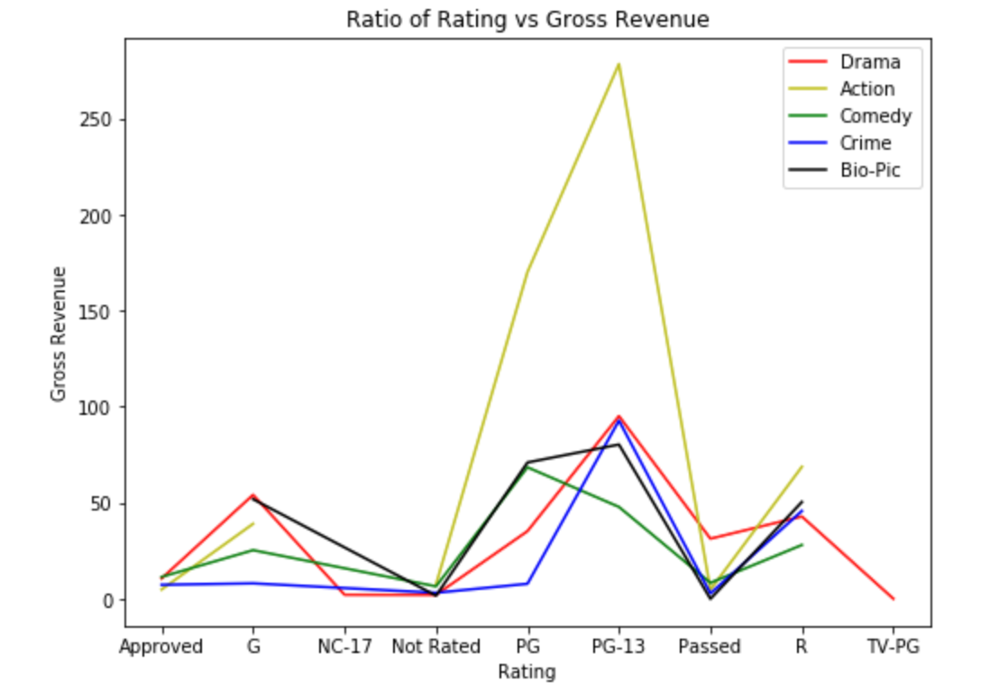

**Author** [Kelvin Arellano & Alieu Baldeh]
## Overview
This Repository dives into various relationships between different publicly available data relating to movies and revenue. We used data from IMDB and the Movie Database so as to better understand trends and pave a way forward in creating new and exciting movies.
## Business Problem
Microsoft sees all the big companies creating original video content and they want to get in on the fun. They have decided to create a new movie studio, but they don’t know anything about creating movies. You are charged with exploring what types of films are currently doing the best at the box office. You must then translate those findings into actionable insights that the head of Microsoft's new movie studio can use to help decide what type of films to create.
## Data
We gathered data mainly from IMDB with supplemental material coming from the Movie Database api.
## Methods
We started with just thinking about what convinces us personally to be interested in a movie. Our main points of interest was the director behind a movie, the genre of the movie, and the general reception of the movie.
## Results
Looking at these points, we investigated the data to see what effect these data points have on revenue. What we found was that directors have the greatest effect on the revenue brought in as the data clusters closely together except for the top ten Directors.

We then looked at the relationship between  genre and revenue to see which genre would have the greatest chance of return on investment and found that action movies have the greatest return on investment.

Lastly we looked into how user inputed scores on IMDB correlate with revenue, and found that it has a much lesser correlation to revenue and  a slight positive trend.

## Conclusions
Through these findings we concluded that if we would be able to convince a director to sign up to a project that would be the best way to invest any initial capital, followed by sticking to the action genre and following well received movie synopsis.
## Next Steps
For our next steps we would want to see the relationship that these factors have with foreign markets, are there any other factors that have a greater effect to revenue at a smaller initial cost, and better analyze the data but removing initial budget from total revenue.

## Repository Structure
```
├── notebooks
├── data
├── images
├── Movie_pitch.md
└── Movie_analysis.ipynb
```
